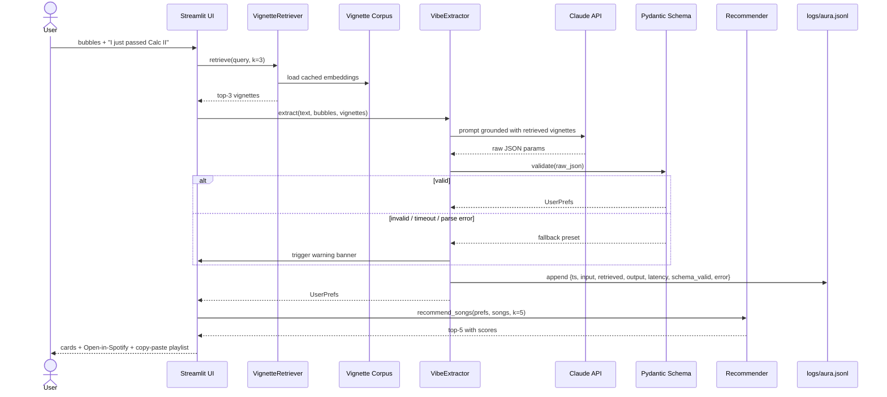

# 🎵 Music Recommender Simulation

## Project Summary

Aura is a music recommender with two ways in: a **vibe check-in** where you describe what's going on in plain English ("I just passed Calc II", "rainy day, can't focus"), and a **manual tuning** mode where you dial genre, mood, energy, valence, danceability, and tempo by hand.

Behind the vibe check-in, a **RAG pipeline** retrieves the most semantically similar examples from a labelled corpus of life-moment vignettes and uses them to ground a Claude API call that maps free-text vibes into the same parameter dict the manual mode produces. The LLM never invents genres, never goes out of range, and never crashes the user — a Pydantic schema validates every output and a deterministic fallback preset takes over on any failure.

The deterministic scoring engine does the actual ranking. The LLM is a UX adapter on the front; the recommender stays testable and the AI layer stays swappable.

The project also includes adversarial tests that expose real bugs in the scoring logic, a model card documenting limitations and bias, and a reflection on what a simple algorithm can and can't do.

---

## How The System Works

Each **Song** in the catalog carries ten attributes: a unique id, title, and artist name, plus seven musical features — genre, mood, energy level (0–1), tempo in BPM, valence (how positive the song feels, 0–1), danceability (0–1), and acousticness (0–1).

A **UserProfile** stores what the listener cares about: their favourite genres, favourite moods, target energy level, target valence, target danceability, target tempo, and whether they lean toward acoustic music.

### Algorithm Recipe

#### Scoring Rule — rating one song at a time

When the recommender looks at a single song, it computes a weighted score across three priority tiers:

| Priority | Feature | Weight | How it's calculated |
|---|---|---|---|
| P1 | Mood match | 0.17 | Binary — 1 if song mood is in user's mood list, else 0 |
| P1 | Genre match | 0.13 | Binary — 1 if song genre is in user's genre list, else 0 |
| P2 | Energy distance | 0.175 | `1 - abs(song.energy - target_energy)` |
| P2 | Valence distance | 0.175 | `1 - abs(song.valence - target_valence)` |
| P3 | Danceability distance | 0.15 | `1 - abs(song.danceability - target_danceability)` |
| P3 | Tempo distance | 0.15 | Tempo normalised to 0–1 before subtracting |
| Penalty | Acoustic penalty | up to −0.10 | `acousticness × 0.10` subtracted when user dislikes acoustic |

**P1 total: 30% · P2 total: 35% · P3 total: 30%**

Key design decisions:
- **Mood is weighted above genre** — mood crosses genre lines more naturally. A user who wants something "nostalgic" can find that in rock, pop, or jazz.
- **P2 carries the most weight** — energy and valence are the core of discovery. A song from an unexpected genre can surface if it *feels* right.
- **No hard genre filter** — songs outside the user's stated genres are not excluded, only nudged down. This preserves the exploration aspect of music discovery.

#### Ranking Rule — choosing what to surface

Once every song has a score, the system applies four steps to decide the final list:

1. **Top-K selection** — keep only the highest-scoring songs (default K = 5)
2. **Diversity** — cap the number of songs per artist to avoid the list being dominated by one act
3. **Tie-breaking** — when two songs have equal scores, prefer higher valence as a tiebreaker
4. **Filters** — songs the user has already heard can be excluded before ranking begins

The final output is an ordered list of songs, each paired with its score and a plain-language explanation of why it was recommended.

---

## Vibe Check-In: RAG-Grounded Vibe Extraction

Most users don't want to dial seven sliders to hear five songs. The vibe check-in replaces that with a short natural-language input ("I just passed Calc II") and a few optional mood bubbles, then uses **Retrieval-Augmented Generation** to translate that into the same `UserPrefs` dict the recommender already accepts.

### How RAG is integrated

A small corpus of ~30 hand-labelled vignettes lives in [`data/vignettes.jsonl`](data/vignettes.jsonl). Each entry pairs a real human situation with a target preset:

```json
{"vignette": "Just got broken up with, want to feel my feelings",
 "preset": {"genre": ["indie pop", "pop"], "mood": ["melancholic", "moody"],
            "target_energy": 0.35, "target_valence": 0.2, ...}}
```

At runtime, the system:

1. **Embeds** the user's input with `sentence-transformers/all-MiniLM-L6-v2` (local, free, deterministic)
2. **Retrieves** the top-3 most cosine-similar vignettes from the corpus
3. **Injects** them into the Claude API prompt as worked few-shot examples
4. **Validates** the LLM's JSON output against a Pydantic schema with bounded ranges and a closed genre/mood vocabulary
5. **Falls back** to a safe preset (incorporating the user's mood bubbles) if anything fails — timeout, malformed JSON, schema violation
6. **Logs** every call as a structured JSON line to `logs/aura.jsonl`

The retrieved vignettes **actively shape** the LLM's output — they are not printed alongside a generic answer. Replace the corpus, change the system's behaviour. That is the rubric's RAG requirement satisfied.

### System architecture



### Guardrails and reliability

- **Schema validation**: every LLM response is parsed and validated against [`src/schema.py`](src/schema.py). Out-of-range values, invented genres, missing fields, and malformed JSON all reject cleanly.
- **Bounded ranges**: `target_energy/valence/danceability ∈ [0, 1]`, `target_tempo_bpm ∈ [60, 200]` — the range over which the recommender's normalization is well-defined.
- **Closed vocabulary**: `genre` and `mood` are `Literal` types matching the songs catalog. The LLM cannot widen the vocabulary at runtime.
- **Timeout**: 10-second cap on the LLM call. Beyond that, fallback path triggers.
- **Deterministic fallback**: when extraction fails, a safe preset (preserving the user's mood bubble selections) is used so the recommender always receives valid input. The user sees a banner explaining what happened.
- **Structured logging**: `logs/aura.jsonl` records timestamp, input, retrieved vignettes, raw LLM output, parsed result, latency, schema-validity, and any error — one JSON line per call.

---

### Expected Biases

- **Mood over genre** — because mood is weighted higher than genre, the system may surface songs from genres the user didn't list if the emotional tone is close. This is intentional for discovery but could feel surprising.
- **Energy and valence centrality** — P2 has the highest total weight, so songs that match the user's energy and emotional target will rank highly even when genre and mood miss. This may over-reward "feeling right" at the expense of stylistic fit.
- **Catalog skew** — the 20-song catalog is not evenly distributed across genres and moods. Genres with more representation (e.g. pop, rock) will appear in results more often simply because there are more candidates to score well.
- **Acoustic users are underserved** — the acoustic penalty only applies when `likes_acoustic = False`. There is no equivalent boost for users who actively prefer acoustic music, which creates an asymmetry.

---

## Sample Output

Running `python -m src.main` with the default taste profile (`genre: [pop, indie pop]`, `mood: [happy, nostalgic]`, `target_energy: 0.80`) produces:

```
==================================================
  Top 5 Recommendations for You
==================================================

#1  Sunrise City — Neon Echo
    Genre: pop  |  Mood: happy
    Score: 0.92
    Why:   mood match — happy (+0.17) · genre match — pop (+0.13) · energy fit (+0.17) · valence fit (+0.17) · danceability fit (+0.15) · tempo fit (+0.15) · acoustic penalty (-0.02)

#2  Rooftop Lights — Indigo Parade
    Genre: indie pop  |  Mood: happy
    Score: 0.89
    Why:   mood match — happy (+0.17) · genre match — indie pop (+0.13) · energy fit (+0.15) · valence fit (+0.17) · danceability fit (+0.15) · tempo fit (+0.15) · acoustic penalty (-0.03)

#3  Shape of You — Ed Sheeran
    Genre: pop  |  Mood: happy
    Score: 0.88
    Why:   mood match — happy (+0.17) · genre match — pop (+0.13) · energy fit (+0.15) · valence fit (+0.16) · danceability fit (+0.15) · tempo fit (+0.15) · acoustic penalty (-0.03)

#4  Blinding Lights — The Weeknd
    Genre: pop  |  Mood: nostalgic
    Score: 0.73
    Why:   mood match — nostalgic (+0.17) · genre match — pop (+0.13) · energy fit (+0.16) · valence fit (+0.12) · danceability fit (+0.11) · tempo fit (+0.10)

#5  Gym Hero — Max Pulse
    Genre: pop  |  Mood: intense
    Score: 0.71
    Why:   genre match — pop (+0.13) · energy fit (+0.15) · valence fit (+0.14) · danceability fit (+0.15) · tempo fit (+0.14)

==================================================
```

---

## Getting Started

### Setup

1. Create a virtual environment (recommended):

   ```bash
   python -m venv .venv
   source .venv/bin/activate      # Mac or Linux
   .venv\Scripts\activate         # Windows
   ```

2. Install dependencies:

   ```bash
   pip install -r requirements.txt
   ```

   First run pulls down the `all-MiniLM-L6-v2` embedding model (~80MB, cached after).

3. Configure your Anthropic API key:

   ```bash
   cp .env.example .env
   # then edit .env and paste your real key from https://console.anthropic.com/
   ```

   Without a key, the vibe check-in will always fall back to its safe preset.

4. Run the Streamlit app:

   ```bash
   streamlit run app.py
   ```

   The CLI version still works too:

   ```bash
   python -m src.main
   ```

### Running Tests

```bash
pytest
```

Tests live in `tests/test_recommender.py`.

### Where to look

- [`app.py`](app.py) — Streamlit UI with vibe check-in and manual tuning tabs
- [`src/recommender.py`](src/recommender.py) — deterministic scoring + ranking
- [`src/retrieval.py`](src/retrieval.py) — embeds the vignette corpus, serves top-k cosine lookups
- [`src/extractor.py`](src/extractor.py) — RAG pipeline: retrieve → prompt Claude → validate → fallback → log
- [`src/schema.py`](src/schema.py) — Pydantic guardrail and fallback preset
- [`data/songs.csv`](data/songs.csv) — song catalog
- [`data/vignettes.jsonl`](data/vignettes.jsonl) — the labelled corpus that grounds the LLM
- `logs/aura.jsonl` — created at first run; one JSON line per LLM call

---

## Experiments I Tried

- Tested six user profiles (pop dancer, workout, study, jazz café, melancholic indie, synthwave) and compared their top 5 results side by side.
- Ran adversarial profiles — including a user with `target_tempo_bpm: 250` — and found the normalization formula produces negative scores outside the [60, 200] BPM range.
- Tested a "chill lofi" user with `likes_acoustic: False` and confirmed the acoustic penalty hurts every song in their preferred genre cluster.
- Compared two songs from the same genre where the perfect energy match lost to a worse match purely because of acousticness — exposing a ranking inversion bug.

---

## Limitations and Risks

- Works on 20 songs. Niche genres like jazz get one good result then fall back to unrelated music.
- Mood matching is binary — "nostalgic" and "melancholic" are treated as completely unrelated.
- The acoustic flag only penalizes, never rewards. Acoustic lovers are not actually served better.
- Tempo inputs above 200 BPM break the scoring formula and produce negative values.
- Pop dominates the catalog (6/20 songs), so pop fans get more relevant results by default.

See the [Model Card](model_card.md) for a full breakdown.

---

## Reflection

Read and complete `model_card.md`:

[**Model Card**](model_card.md)

A recommender system is just arithmetic with good labels. Each song gets a number, the numbers get sorted, and the top five come out. What makes it feel intelligent is the explanation — seeing "mood match — happy" next to a score makes it seem like the system understood you. But strip the labels away and it's subtraction and multiplication. Building this made that gap between appearance and reality very concrete.

Bias showed up in places I didn't expect. The worst case wasn't a bug in the formula — it was a gap in the data. The Jazz Café profile returned one great result and four lofi songs because there was only one jazz song in the catalog. No scoring logic can fix that. The system was also quietly biased toward upbeat content through the valence tiebreaker: every tie resolved toward happier songs, regardless of what the user asked for. That kind of hidden default is easy to miss because it only surfaces in edge cases, not in normal runs.


---

## Model Card

The full model card covers intended use, how the scoring works, data, strengths, limitations, evaluation, and a personal reflection.

[**Read the Model Card →**](model_card.md)
